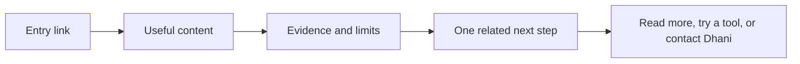

# DeepQA Portfolio Website v1 - Product Spec

**Lifecycle**: ACTIVE
**Owner**: Dhani
**Next consumer**: `/plan-technical-spec`
**Review trigger**: UX, scope, or visitor evidence change

Product PRD: [prd.md](./prd.md)

## Overview

DeepQA is a personal QA portfolio that leads with useful work. A visitor reads an article, report, tool note, or case study, then sees one related next step. The site must feel calm, personal, and evidence-led while helping recruiters, buyers, and QA practitioners judge fit.

## User Stories

### Useful content

1. (P1) As a QA practitioner, I want to read a useful article, so that I can learn from real QA work.
2. (P1) As a visitor, I want one related next step, so that I can continue without competing offers.
3. (P2) As a visitor, I want to share or save useful work, so that I can return later.

### Proof and fit

1. (P1) As a recruiter, I want to understand Dhani's strongest work quickly, so that I can decide whether to continue.
2. (P1) As a buyer, I want to inspect a relevant case study, so that I can decide whether to start a conversation.
3. (P1) As a visitor, I want to see evidence and limits, so that I can judge credibility.

## Spec: Article and contextual next step

### User Story

As a visitor, I want to read an approved article and see one related next step, so that I can continue without a sales wall.

### Problem

The current home page has article cards but no real article path. A visitor cannot inspect the source work or continue through a clear related action.

### Solution

Create one real article page for the approved LinkedIn workflow article. Keep the home page as the entry point and link the article back to one relevant next step.

### Functional Specification

- The home page links the featured article to a real article path.
- The article shows the approved text and saved image.
- The article keeps the author's meaning and does not expose internal data.
- The article offers one related next step after the useful content.
- Other article cards remain visibly unavailable until their content is approved.
- A missing article or image shows a clear fallback instead of a broken layout.

### Non-Functional Specification

- The article remains readable on a phone and desktop browser.
- The main content appears within the approved page-load guardrail.
- The page uses accessible headings, links, alt text, and keyboard focus states.

## Spec: Evidence and selected work

### User Story

As a recruiter or buyer, I want to inspect selected work and its limits, so that I can judge seniority and fit.

### Problem

The current about section states a method but does not show enough concrete scope, results, or limits.

### Solution

Use a selected-work section inside the existing editorial structure. Present sanitized case-study summaries, clear evidence labels, and one matching next step.

### Functional Specification

- Selected work states the problem, the work, the result, and the known limit.
- Claims without evidence are labelled as proposals or removed.
- Internal ticket keys, host names, credentials, private screenshots, and test data do not appear.
- A case study links to a relevant article, tool, or approved contact path.
- The about section keeps a personal explanation of method and focus.

### Non-Functional Specification

- The content scans in less than one screen of reading before the first proof point.
- The visual style uses the approved quiet-authority palette and keeps strong contrast.
- The content does not rely on motion, color, or hover alone to convey meaning.

## Spec: Contact and measurement

### User Story

As Dhani, I want visitors to choose a relevant next step and record that choice, so that I can learn whether the portfolio helps.

### Problem

No visitor analytics exist, and the current contact link is a placeholder.

### Solution

Add privacy-light event hooks for content views and related-link clicks. Use one approved contact destination only after Dhani provides it. Do not ship the placeholder address.

### Functional Specification

- The page records content type and related-link click events without personal data.
- The page does not require a backend or database for core reading flows.
- The contact action stays hidden or points to an approved destination until configured.
- Event hooks fail silently and never block content reading.

### Non-Functional Specification

- Event code adds no visible delay to the page.
- The page remains useful when analytics are unavailable.
- No secret key or private identifier is placed in frontend code.

## Assumptions

- Dhani owns or can republish the first article text and image.
- Dhani can approve sanitized project facts before publication.
- Static hosting is enough for the first release.
- A privacy-light measurement provider can be selected later without changing the content flow.

## Open Questions

- Which public email or profile should be the contact destination?
- Which three sanitized artifacts should support the first selected-work summary?
- Which analytics provider and consent rule should receive the event hooks?

---

**Status**: APPROVED
**User approval**: Approved by Dhani on 2026-09-22 for the development workflow through `/plan-implement`.
