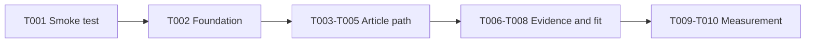

# DeepQA Portfolio Website v1 - Implementation Tasks

**Lifecycle**: ACTIVE
**Owner**: Dhani
**Next consumer**: `/plan-implement`
**Review trigger**: scope, dependency, or verification change

## Readiness

**Status**: PASS

- Product Spec: PASS
- Technical Spec: PASS
- Contract Spec: PASS / N/A for external interfaces
- Cross-Spec: PASS
- Open Blocking/High: None

**User approval**: approved — Dhani approved the pipeline through `/plan-implement` on 2026-09-22.
**Baseline**: 4ce44a4 refine hero proof points
**QA depth**: Focused

## Phase 1: Setup

- [x] T001 [P] Create a static portfolio smoke test in `tests/portfolio-smoke.mjs`.
  - Acceptance: The test checks required files, article links, image references, required landmarks, and the absence of the placeholder contact address. It fails before the feature files exist.

**Checkpoint**: Setup ready

## Phase 2: Foundational

- [x] T002 [P] Add the shared content and accessibility checks needed by the article and selected-work stories in `tests/portfolio-smoke.mjs`.
  - Acceptance: The checks use Node built-ins only, do not require a server or database, and do not inspect private data.

**Checkpoint**: Foundation ready

## Phase 3: User Story 1 - Useful article path (Priority: P1, MVP)

**Goal**: A visitor can open the first approved article and follow one related next step.

**Independent Test**: Open the home page, follow the featured article, read the article with its local image, and follow the related link with JavaScript disabled.

### Implementation

- [x] T003 [US1] Add the approved article page at `dist/articles/claude-qa-workflow.html`.
  - Acceptance: The page uses semantic HTML, the approved article text, a local image with alt text and intrinsic dimensions, a source note, and one related next step.
- [x] T004 [US1] Link the featured article and related content paths from `dist/index.html`.
  - Acceptance: The featured card opens the article path; unavailable cards do not use misleading `#` actions; core navigation works without JavaScript.

### Review

- [x] T005 [US1] Story review by an independent reviewer.
  - Acceptance: Article acceptance criteria, Product/Technical/Contract compliance, privacy checks, and smoke tests all PASS.

**Checkpoint**: US1 independently functional and reviewed

## Phase 4: User Story 2 - Evidence and fit (Priority: P1)

**Goal**: A recruiter or buyer can scan selected work, evidence, limits, and a safe next step.

**Independent Test**: Open the home page at desktop and mobile widths, scan selected work, and verify that no placeholder contact or private data appears.

### Implementation

- [x] T006 [US2] Add a selected-work section and update the navigation in `dist/index.html`.
  - Acceptance: The section states scope, work, result, and limit for approved examples and links to the relevant article or tool path.
- [x] T007 [US2] Apply frontend best-practice hardening in `dist/index.html` and `dist/styles.css`.
  - Acceptance: Headings remain ordered, focus states are visible, content does not rely on hover or color alone, the article image is lazy-loaded, and the placeholder email is not shipped.

### Review

- [x] T008 [US2] Story review by an independent reviewer.
  - Acceptance: Evidence, privacy, responsive behavior, accessibility checks, and smoke tests all PASS.

**Checkpoint**: US2 independently functional and reviewed

## Phase 5: User Story 3 - Portfolio measurement (Priority: P1)

**Goal**: The site exposes privacy-light event hooks without requiring a backend or database.

**Independent Test**: Load the site without an analytics endpoint, confirm reading and navigation work, and observe `deepqa:track` events without personal data.

### Implementation

- [x] T009 [US3] Add the optional analytics adapter in `dist/script.js` and `data-track` attributes in `dist/index.html` and the article page.
  - Acceptance: Content-view and related-link events dispatch locally; `tests/analytics-smoke.mjs` passes; no event blocks navigation; no endpoint is called unless explicitly configured; no personal data is sent.

### Review

- [x] T010 [US3] Story review by an independent reviewer.
  - Acceptance: Event behavior, failure handling, privacy checks, and smoke tests all PASS.

**Checkpoint**: US3 independently functional and reviewed

## Dependencies & Execution Order

- T001 → T002 → US1 → US2 → US3
- T003 and T004 share `dist/index.html` and run in order.
- No backend, database, new dependency, or external API is required.

## Checkpoint Plan

| Checkpoint | Trigger | Tasks |
| --- | --- | --- |
| CP1 | US1 completion | T001-T005 |
| CP2 | US2 completion | T006-T008 |
| CP3 | US3 completion | T009-T010 |

Gate protocol (review, regression, retrospective, git) is defined by `/plan-implement`.

## Progress Notes

### T001-T002 — Smoke checks

Status: PASS
Changed: `tests/portfolio-smoke.mjs`
Validation: test-first failure recorded before feature files; final smoke test PASS

### T003-T005 — Useful article path

Status: PASS
Changed: `dist/articles/claude-qa-workflow.html`, `dist/index.html`, `dist/styles.css`, `dist/script.js`
Validation: `node --check dist/script.js` PASS · `node tests/portfolio-smoke.mjs` PASS · independent reviewer PASS

### Checkpoint CP1 (T001-T005)

**Went well**: The article path stayed static, local, and progressive. The smoke test caught missing content before implementation.
**Went wrong**: The first review found a no-JS navigation gap, a placeholder action, wrong image dimensions, and no image fallback.
**Improve**: Keep the no-JS path explicit in future static page tasks and verify asset dimensions from the file.

### T006-T008 — Evidence and fit

Status: PASS
Changed: `dist/index.html`, `dist/styles.css`, `tests/portfolio-smoke.mjs`
Validation: `node --check dist/script.js` PASS · `node tests/portfolio-smoke.mjs` PASS · independent reviewer PASS

### Checkpoint CP2 (T006-T008)

**Went well**: Selected-work cards now show source labels, limits, and relevant next steps. The placeholder contact action was removed.
**Went wrong**: The first review found unsupported-looking proof claims and missing limits.
**Improve**: Treat every public metric as a claim that needs a visible source label and limit.

### T009-T010 — Portfolio measurement

Status: PASS
Changed: `dist/script.js`, `tests/analytics-smoke.mjs`, `tests/portfolio-smoke.mjs`
Validation: analytics smoke PASS · portfolio smoke PASS · Node syntax PASS · independent reviewer PASS

### Checkpoint CP3 (T009-T010)

**Went well**: Event hooks stay disabled by default, do not block navigation, and send no personal data.
**Went wrong**: The test does not exercise the configured endpoint branch.
**Improve**: Add provider-specific contract coverage only when an analytics endpoint is approved.
