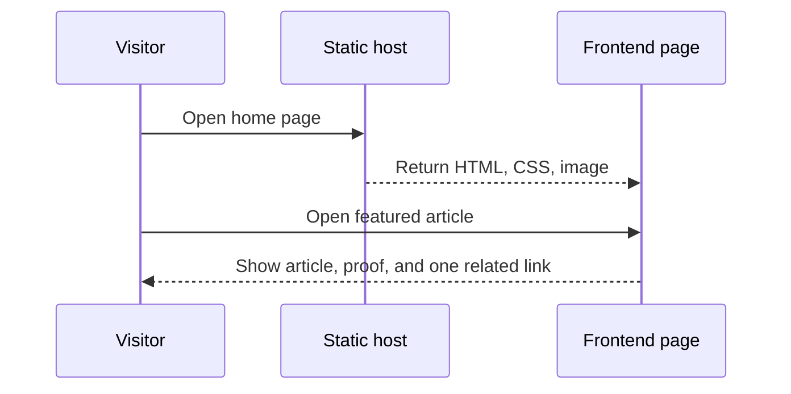

# DeepQA Portfolio Website v1 - Technical Spec

**Lifecycle**: ACTIVE
**Owner**: Dhani
**Next consumer**: `/plan-contract-spec`
**Review trigger**: architecture, content delivery, or analytics implementation change

Product Spec: [product-spec.md](./product-spec.md)

## Architecture Overview

The first release stays a static frontend. HTML pages, CSS, JavaScript, and approved local images are served from `dist/` through the existing static host. No backend or database is needed because reading content, navigating links, and showing proof do not require server state.

The frontend uses progressive enhancement. Core links and article content work without JavaScript. A small analytics adapter emits privacy-light events only when an endpoint is explicitly configured. The default build sends no event and contains no secret.

## Components

- **Static page shell** — shared navigation, typography, metadata, and footer.
- **Article page** — approved article text, local image, source context, and one related next step.
- **Selected-work content** — sanitized proof summaries inside the existing page structure.
- **Analytics adapter** — optional event dispatch with no blocking network call by default.
- **Static host** — serves the `dist/` directory using the existing project configuration.

There is no backend service and no database in this release. Adding either would increase cost and failure modes without serving a current product requirement.

## Model & Entities

No database model or schema change is required. Content is versioned with the static project files.

## Article and contextual path

The home page links the featured article to `dist/articles/claude-qa-workflow.html`. The article loads the shared stylesheet, uses the approved local image at `dist/assets/claude-qa-workflow.jpg`, and provides one related next step after the article body. The page must keep working if JavaScript is disabled.

### APIs List

| Path | Method | Version | Status |
| --- | --- | --- | --- |
| None | — | — | No new or modified external interface |

## Specification

### Frontend

- Keep shared navigation and footer markup consistent across pages.
- Use semantic landmarks, one page heading, ordered heading levels, descriptive link text, and image `alt` text.
- Use local relative asset paths that work from the article URL.
- Use `loading="lazy"` for the article image and include intrinsic `width` and `height` values.
- Keep content readable without JavaScript, hover, animation, or color alone.
- Preserve the quiet-authority palette: paper, ink, cobalt, muted lime, and pale blue-gray.
- Add visible focus styles for links and buttons.
- Keep the existing mobile breakpoints and test the article at narrow widths.

### Content safety

- Copy only the owner-approved article text.
- Do not add internal URLs, ticket IDs, credentials, private screenshots, or test data.
- Keep the LinkedIn source link as attribution only when the owner approves it.
- Treat content as trusted, versioned source files. Do not render user-entered HTML.

### Analytics adapter

- Add `data-track` attributes to the article view and related-link elements.
- Dispatch a `deepqa:track` `CustomEvent` with a small event name and content type.
- If `window.DEEPQA_ANALYTICS_ENDPOINT` exists, send a JSON event with `navigator.sendBeacon`.
- Do not send email addresses, names, query strings, or free-form content.
- Ignore send failures. Never block navigation or article rendering.
- Do not add a third-party analytics script in this release.

### Backend and database decision

- **Backend**: none. The static host serves all required content.
- **Database**: none. Article and proof content remain in versioned files.
- **Future change trigger**: add a backend or database only when approved behavior needs private data, user accounts, server-side search, form processing, or aggregate analytics storage.

### Reliability and security

- Core navigation must work when JavaScript fails.
- Broken optional analytics must not affect reading or navigation.
- The article image must have a local fallback state if the file is missing.
- No credentials or provider tokens may enter the repository or frontend bundle.
- Keep external font loading optional; system fonts must provide a readable fallback.

### Quality plan

- Syntax check `dist/script.js` with Node.
- Check all referenced files exist.
- Check the article and home links with a local static server.
- Use a browser smoke check for desktop and mobile widths.
- Use `git diff --check` before each checkpoint.

Key files:

- `dist/index.html`
- `dist/articles/claude-qa-workflow.html`
- `dist/styles.css`
- `dist/script.js`
- `dist/assets/claude-qa-workflow.jpg`

---

**Status**: APPROVED
**User approval**: Approved by Dhani on 2026-09-22 for the development workflow through `/plan-implement`.
